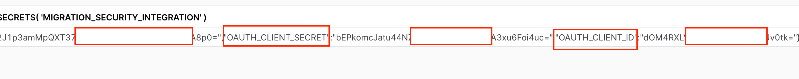
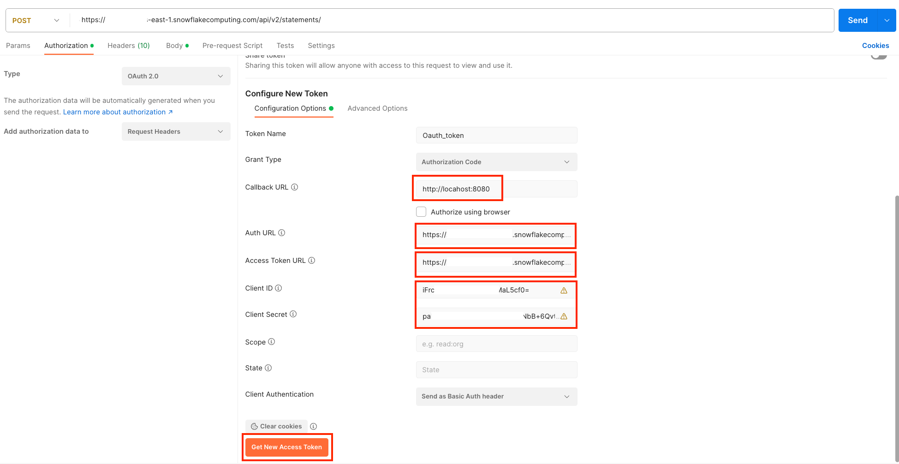
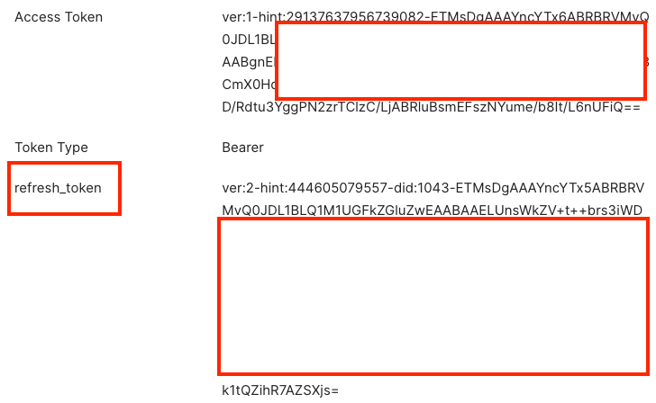
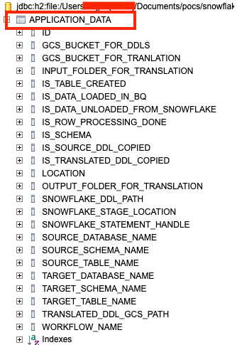

# Snowflake To BigQuery Data Transfer

This connector helps in transferring(migrating) the Snowflake data(Schema,Table) to BigQuery. \
It can help in automating the historical load migration.

# Quick Start

Prerequisites:
* [gcloud CLI](https://cloud.google.com/sdk/gcloud)
* Maven
* Java 11
* GCP project
* Snowflake project
* Appropriate access to Snowflake account
* Clone the repository

# Setting up authentication
Below steps can be followed for setting up authentication & authorization:
* Oauth Token Generation
```
CREATE or REPLACE SECURITY INTEGRATION OAUTH_FOR_REST_API
  TYPE = OAUTH
  ENABLED = TRUE
  OAUTH_CLIENT = CUSTOM
  OAUTH_CLIENT_TYPE = <Appropriate Value>
  OAUTH_REDIRECT_URI = 'http://locahost:8080'
  OAUTH_ISSUE_REFRESH_TOKENS = TRUE
  OAUTH_REFRESH_TOKEN_VALIDITY = 86400
  OAUTH_ALLOW_NON_TLS_REDIRECT_URI=true; --(This line is not needed if redirect URL is https)
```
* Fetch the clientId and secret from Snowflake
``` 
select SYSTEM$SHOW_OAUTH_CLIENT_SECRETS( 'OAUTH_FOR_REST_API' )
```


* Generate the one time access token using the above clientId, secret, snowflake URL( ```https://<account>.snowflakecomputing.com/api/v2/statements/```) \
and postman. Below query can be used to find the values of Auth URL, Access Token URL and other details.
```
 DESC SECURITY INTEGRATION OAUTH_FOR_REST_API;
```
OAUTH_AUTHORIZATION_ENDPOINT=Auth URL and OAUTH_TOKEN_ENDPOINT= Access Token URL of postman.



* Copy the refresh token from the generated token after authenticating using the Snowflake credentials.



* This refresh token will be encrypted in the connector, connector will keep on refreshing the token  and get new access token until the max duration \ 
  which is set in security integration against key OAUTH_REFRESH_TOKEN_VALIDITY expires.

# Build connector
* Update the [application.properties](src/main/resources/application.properties) file based on your Snowflake instance and need. The properties file contains \
  descriptions for each property. Additionally, connector allows you to provide property values during application startup, eliminating the need to repeatedly \
  build the JAR file. 
* Example
```
java -jar {PATH OF JAR } --snowflake.table.query.mapping.path=/Users/tests/snowflake_table_query_mapping.json \
--snowflake.request.body.json.path=/Users/tests/snowflake_request_body.json --snowflake.account.url=https://<account-name>.us-east-1.snowflakecomputing.com \
--jdbc.url=jdbc:snowflake://https:/<account-name>.us-east-1.snowflakecomputing.com --spring.datasource.h2.url=jdbc:h2:file:/Users/tests/db
```
* Build the code from src and pom.xml directory level
```
mvn clean package 
```

# Run the Connector
* After building the Connector, it can be started using the command ```java -jar {path to the jar}```. After following the step \
  mentioned in [Build connector](#build-connector) step, the connector jar will be generated in the target folder. This jar is \
  executable across any JRE 11-compatible environments. 
* Once the connector is started, it can accept rest calls. User can use postman or curl command to execute the rest API calls.

# Setting Access Token
* Refresh Token generated from the step [Setting up authentication](#Setting up authentication) should be set in the connector, \ 
  connector will automatically keep on refreshing it until the max expiry of refresh token. Connector keeps the value in encrypted format in a map.
* Request URL and body
```
Request Type: POST
URL: http://localhost:8080/connector/save-oauth-values
BODY: 
        { "clientId":"79dAYOORu",
        "clientSecret":"MJONWzHYmtkrqdI",
        "refreshToken":"ver:2-hint:444605079557-did:"
        }
```
* **CURL command**  
```
curl --location 'http://localhost:8080/connector/save-oauth-values' \
--header 'Content-Type: application/json' \
--data '{"clientId":"79dAYOORu",
"clientSecret":"MJONWzHYmtkrqdI",
"refreshToken":"ver:2-hint:444605079557-did:"
}'
```
* Change the local host to the appropriate ip_address if connector is not started in same machine where the request are being executed.
* Above method will set the token in runtime, and it can be updated anytime when application is running. Initially generated access token \
  remains active for 10 min so make sure to execute this steps with in 10 min.
* Token value will be encrypted by application before use and will not be printed in the connector logs.

# Migrate Data
* Data migration can be started using another rest API.
* Before executing this API we need to have below resources created.
* GCS buckets for storing ddls, translated ddls and snowflake tables. We can use one bucket for all the resources if required, Connector \
  will create "**snowflake-ddls**","**translated-snowflake-ddls**","**backup-ddls**" with in the bucket to store **ddls**, **translated ddls**\
  and **backup of old ddls** respectively.
* BigQuery dataset. Table can be created beforehand or let it be created by connector.
* Snowflake STORAGE INTEGRATION and access to use it by specific user(which will be used for OAuth token) for creating stage at runtime. \
    Command is given in the **[Script file](docs/snowflake-object-creation.txt)**
* **Request URL and Body**
```
Request Type: POST
URL: http://localhost:8080/connector/migrate-data
BODY: 
         {
            "sourceDatabaseName": "TEST_DATABASE",
            "sourceSchemaName": "public",
            "sourceTableName": "orders",
            "targetDatabaseName": "terragrunt-test2",
            "targetSchemaName": "test_dataset",
            "schema": false,
            "bqTableExists": true,
            "gcsBucketForDDLs": "snowflake-to-gcs-migration",
            "gcsBucketForTranslation": "snowflake-to-gcs-migration",
            "location": "us",
            "snowflakeStageLocation":        "snowflake-to-gcs-migration/data-unload",
            "snowflakeFileFormatValue":"SF_GCS_PARQUET_FORMAT1",
            "bqLoadFileFormat":"PARQUET"
         }


Note: Set schema:true, to migrate all the tables present in the schema.
```
* **Definition of body parameters**
```
sourceDatabaseName: Database name in Snowflake to be migrated to BigQuery.
sourceSchemaName: Schema name in a database to be migrated.
sourceTableName: Table names to be migrated, if full schema is not getting migrated, user can give comma separated value to migrate more than 1 table.
targetDatabaseName: BigQuery does not have database concept, this is basically the project name in GCP.
targetSchemaName: Dataset name in BigQuery.
schema: This parameter will define if we are migrating the full schema or not. True means all the tables in the schema will be migrated without 
        even providing the table names using parameter "sourceTableName". It gets preference over "sourceTableName", if this is true then table name will be ignored.
bqTableExists: If true, connector will assume that table is already created beforehand, if false connector will create the table before loading.
gcsBucketForDDLs: This GCS bucket will hold the DDLS extracted from Snowflake for the table name.
gcsBucketForTranslation: This GCS bucket will hold the translated DDLs which will be used to create table in BigQuery.
location: location to be used for running translation job and bigquery load
snowflakeStageLocation: This is basically the storage location, its gets used in creating stage. Different stage prepend this value to other dynamic values.
                        All the data files from Snowflake will go inside this folder location.
snowflakeFileFormatValue: The format in which data from Snowflake table will be unloaded to GCS, it should be created beforehand in Snowflake
bqLoadFileFormat: Load format user by bq load job, it should be compatable with snowflakeFileFormatValue.

```
* **CURL command**
```
curl --location 'http://localhost:8080/connector/migrate-data' \
--header 'Content-Type: application/json' \
--data '{
	"sourceDatabaseName": "TEST_DATABASE",
	"sourceSchemaName": "public",
	"sourceTableName": "orders",
	"targetDatabaseName": "terragrunt-test2",
	"targetSchemaName": "test_dataset",
	"schema": false,
	"bqTableExists": true,
	"gcsBucketForDDLs": "snowflake-to-gcs-migration",
	"gcsBucketForTranslation": "snowflake-to-gcs-migration",
	"location": "us",
	"snowflakeStageLocation": "snowflake-to-gcs-migration/data-unload",
    "snowflakeFileFormatValue":"SF_GCS_CSV_FORMAT1",
    "bqLoadFileFormat":"CSV"
}'

```
* This rest API when executed will perform below operations
  * Extract the ddls for the table name from Snowflake.
  * Translate the ddls using translation service to use in BigQuery.
  * export the data from Snowflake to GCS bucket.
  * Create the table in BigQuery if not exists and load the GCS data to BigQuery.
  * Execute to export from Snowflake and load in BigQuery for each table in parallel.
  * Maintain the state of each operation in embedded database to provide restartability in case of failure.

# Extract and Translate DDL
* **Request URL and Body**
```
Request Type: POST
URL: http://localhost:8080/connector/extract-ddl
BODY: 
         {
          "sourceDatabaseName": "TEST_DATABASE",
          "sourceSchemaName": "public",
          "sourceTableName": "DATES_VALUE",
          "targetDatabaseName": "terragrunt-test2",
          "targetSchemaName": "test_dataset",
          "schema": false,
          "gcsBucketForDDLs": "snowflake-to-gcs-migration",
          "gcsBucketForTranslation": "snowflake-to-gcs-migration",
          "location": "us"
          }
```
* **Definition of body parameters**
```
sourceDatabaseName: Database name in Snowflake to be migrated to BigQuery.
sourceSchemaName: Schema name in a database to be migrated.
sourceTableName: Table names to be migrated, if full schema is not getting migrated, user can give comma separated value to migrate more than 1 table.
targetDatabaseName: BigQuery does not have database concept, this is basically the project name in GCP.
targetSchemaName: Dataset name in BigQuery.
schema: This parameter will define if we are migrating the full schema or not. True means all the tables in the schema will be migrated without 
        even providing the table names using parameter "sourceTableName". It gets preference over "sourceTableName", if this is true then table name will be ignored.
gcsBucketForDDLs: This GCS bucket will hold the DDLS extracted from Snowflake for the table name.
gcsBucketForTranslation: This GCS bucket will hold the translated DDLs which will be used to create table in BigQuery.
location: location to be used for running translation job and bigquery load
```
* **CURL command**
```
curl --location --request POST 'http://localhost:8080/connector/extract-ddl' \
--header 'Authorization: Bearer ver:1-hint:29137637956804618-ETMsDgAAAYsBnhlIABR' \
--header 'Content-Type: application/json' \
--data-raw '{
	"sourceDatabaseName": "TEST_DATABASE",
	"sourceSchemaName": "public",
	"sourceTableName": "DATES_VALUE",
	"targetDatabaseName": "terragrunt-test2",
	"targetSchemaName": "test_dataset",
	"gcsBucketForDDLs": "snowflake-to-gcs-migration",
    "schema": false,
	"gcsBucketForTranslation": "snowflake-to-gcs-migration",
	"location": "us"
}
'

```
* This rest API when executed will perform below operations
  * Extract the ddls for the table name from Snowflake.
  * Translate the ddls using translation service to use in BigQuery.
  * Write the result to GCS bucket.
  * It can be valuable if the user wishes to independently create a table after verifying the translation.

# Snowflake Table Export to GCS
* **Request URL and Body**
```
Request Type: POST
URL: http://localhost:8080/connector/snowflake-unload-to-gcs
BODY: 
         {
          "tableNames":["orders"],
          "snowflakeStageLocation": "snowflake-to-gcs-migration/data-unload",
          "snowflakeStageLocation": "SF_GCS_CSV_FORMAT1"
          }

```
* **Definition of body parameters**
```
tableNames: Name of the table which needs to be exported.
snowflakeStageLocation: This is basically the storage location, its gets used in creating stage. Different stage prepend this value to other dynamic values.
                        All the data files from Snowflake will go inside this folder location.
snowflakeFileFormatValue: The format in which data from Snowflake table will be unloaded to GCS, it should be created beforehand in Snowflake.
```
* **CURL command**
```
curl --location --request POST 'http://localhost:8080/connector/snowflake-unload-to-gcs' \
--header 'Authorization: Bearer ver:1-hint:29137637956804618-ETMsDgAAAYsB' \
--header 'Content-Type: application/json' \
--data-raw '{
"tableNames":["orders","teststs"],
"snowflakeStageLocation": "snowflake-to-gcs-migration/data-unload",
"snowflakeFileFormatValue": "SF_GCS_PARQUET_FORMAT1"
}
'

```
* This rest API when executed will perform exporting of table data from Snowflake to GCS.

# Process Failed Requests
* **Request URL and Body**
```
Request Type: GET
URL: http://localhost:8080/connector/process-failed-request

```
* **CURL command**
```
curl --location --request GET 'http://localhost:8080/connector/process-failed-request' \
--header 'Authorization: Bearer ver:1-hint:29137637956804618-ETMsDgAAAYsBnhlIABRBRVMv'
'

```
* When this REST API is invoked, it will reprocess requests that previously failed during the 'migrate-data' API execution, potentially due to errors.\
  The data associated with these requests is stored in the H2 Database. Essentially, this API reprocesses requests for which the Snowflake Export \
  operation was successfully completed. Since the Snowflake Export operation is resource-intensive and costly, it should not be redundantly executed.\
  Conversely, other steps such as extracting DDL and translating DDL are lightweight and can be retried in case of failure. If the Snowflake operation \
  has not yet completed, this API will disregard those pending requests.


* Connector contains a JSON [snowflake_table_query_mapping.json](src/main/resources/snowflake_table_query_mapping.json) which maintains a mapping of table and query.\
  If given query will be used for exporting the data from Snowflakes for the given table. Without this entry Connector exports \
  the data based on full table schema. This will be helpful when user does not want to export all the columns or apply some transformation for any column,\
  like casting timestamp to string, or excluding PII/PHI column etc.

# Snowflake Object Creation

The Connector utilizes several Snowflake entities, such as databases, tables, roles, users, and warehouses. Databases, tables, and schemas should \
ideally be pre-existing, but users have the flexibility to establish distinct roles, users, and warehouses specifically for migration purposes. \
This helps ensure segregation from other entities in the environment. The code includes a straightforward script that can execute these tasks. \
This script is provided as a reference for generating necessary users, roles, and other entities. Prior to any action, it's recommended to seek \
guidance from your enterprise's security and administrative teams, as the script is intended for reference purposes only.

**[Script file](docs/snowflake-object-creation.txt)**

# State Maintenance

The Connector manages the execution state, allowing it to resume from the last successful step in case of failure. It employs the\
[H2 Database](https://www.h2database.com/html/main.html) in embedded mode, storing data in a file mode at the location specified in the application.properties file.

### Connect to H2 Database
* User can connect to H2 Database using the link ```http://localhost:8080/h2-console/login.do``` after starting the Connector on same machine.
* User can key in the required credential which is set in application.properties.

  

* All data is stored within the table named **APPLICATION_DATA**.

  

  

# Disclaimer
This is not an officially supported Google product.