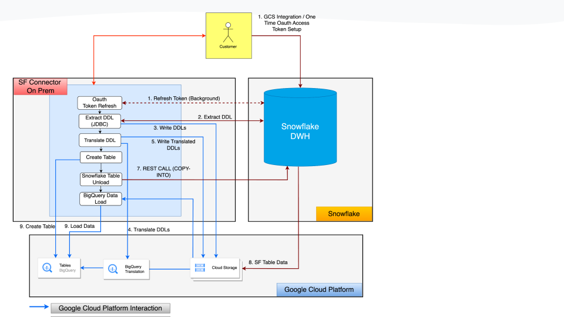
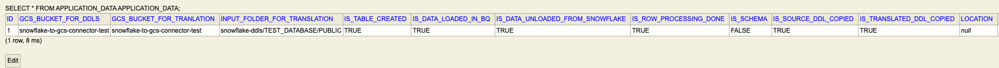
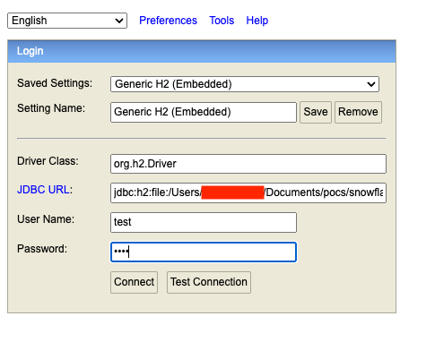

# Snowflake To BigQuery Data Transfer Detailed Documentation [SFBQDT]

* For SFBQDT introduction, please refer to [/README.md](../README.md)
* For SFBQDT supported APIs details, please refer to [/REST_API.md](REST_API.md)
* For SFBQDT supported/non-supported datatype, please refer to [/DATATYPES.md](DATATYPES.md)

# 1. Architecture

The diagram below shows the high-level architecture of data transfer from Snowflake to BigQuery via GCS. This migration
involves schema
translation and table creation in BigQuery. Currently, it only takes care of bulk/batch load transfer. The details of
each step are mentioned
below:

* The table schema can be extracted from Snowflake using JDBC.
* A schema translator is used to convert the Snowflake schema to the BigQuery schema.
* Data is loaded from Snowflake to GCS in a staging bucket.
* A table is created in BigQuery using the translated schema.
* The data is loaded from GCS to the newly created table in BigQuery.

This architecture enables seamless and efficient data transfer from Snowflake to BigQuery. The schema translator ensures
that the data is loaded in the correct format, and the
table creation step ensures that the data is loaded into the correct table in BigQuery. This architecture is also
scalable,as it can be used to load data from Snowflake to BigQuery in parallel for different tables.

   

## 1.1 Snowflake

Before proceeding with the method outlined below, it is necessary to complete a few preparatory steps. To maintain a
structured and traceable migration process, it is advisable to establish distinct user credentials, a separate warehouse
, role assignments, and appropriate permissions. This approach facilitates monitoring usage, tracking access, and
ensuring authorization for relevant objects. The provided script can be utilized to generate all requisite objects
and resources efficiently

### 1.1.1 GCS Integration/Oauth Access Token

Snowflake copy into method is one of the ways to extract/unload data from Snowflake service GCP. We are required to set
up storage integration in Snowflake and give the necessary Google Cloud Storage(GCS) permission to the Snowflake service
account so that files can be written to GCS.

First identify the GCS bucket which will be used for storing the table extraction/unload in Google Cloud Platform(GCP),
identify the format in which data would be extracted. This should be the supported format of the connector(like CSV,
Parquet) and Snowflake.

Run the below command to create the storage integration

```CREATE STORAGE INTEGRATION  {INTEGRATION_NAME}
TYPE = EXTERNAL_STAGE
STORAGE_PROVIDER = GCS
ENABLED = TRUE
STORAGE_ALLOWED_LOCATIONS  = ('gcs://{GCS_BUCKET_NAME}')
```

**Example:**

```CREATE STORAGE INTEGRATION postman_using_copy_into
TYPE = EXTERNAL_STAGE
STORAGE_PROVIDER = GCS
ENABLED = TRUE
STORAGE_ALLOWED_LOCATIONS  = ('gcs://snowflake-to-gcs-copy-into-may/')
```

The GCS path provided here should be a valid GCS bucket path in GCP. Once the integration has been created, the user can
use the following command to describe the integration and extract the service account (SA) from the output. This SA must
be granted the necessary permissions to the bucket in GCP, either at the bucket level or project level.
DESC STORAGE INTEGRATION {INTEGRATION_NAME};

**Example:**

```
DESC STORAGE INTEGRATION postman_using_copy_into;
```

### 1.1.2 Oauth Token Generation

Connector uses the Snowflake OAuth token for authentication and execution of REST APIs.

## 1.2 Connector

Connector is a Java and Spring Boot application that can be run as a Java executable on-premises or deployed to Cloud
Run or GKE.

### 1.2.1 Fetch DDLs

Connector uses JDBC protocol to extract DDL from Snowflake. As DDLs extraction is not the heavy load process hence using
JDBC protocol would be ideal to use. Connector will receive all the required parameters either via command line or as
Input request, it will parse the parameter and based on the received parameter start retrieval of DDLs for the tables.
Connector will use JDBC to request the DDLs using the query below.

#### 1.2.1.1 Fetch DDL for a table

```
select GET_DDL('TABLE', 'TABLE_NAME')
```

#### 1.2.1.2 Fetch all tables in a schema

```
SHOW TABLES IN SCHEMA SCHEMA_NAME
```

Table name would be the dynamic parameter based on received input request.
User input can contain a single or multiple table name or schema. In the case of schema, DDLs for all the tables in the
schema would be fetched.

### 1.2.2 Write DDLs to GCS

After the DDLs are extracted from Snowflake, the connector will write them to GCS. The GCS path is another parameter in
the user's request to the connector. The connector creates a special path pattern and appends it to the received GCS
path.

The connector creates two folders, one for the database name and one for the schema name. This way, the file names
in a bucket can be kept unique.

**Pattern**: ```gs://{BUCKET_NAME}/{DATABASE_NAME}/SCHEMA_NAME/TABLE_NAME.sql```

**Example:** ```gs://snowflake-to-gcs-copy-into-may/TEST_DATABASE/PUBLIC/Dates_value.sql```

Every time the DDLs request is executed, it checks the existing DDL folder and backs it up. The backup folder is named
based on the current date and time (2023_06_16_23_25_55) in the same bucket before the new DDL files are written to the
GCS location.

### 1.2.3 Translate DDLs

The connector uses the SQL Translation/workflow migration API to translate all the DDL files in the schema folder and
write the translated DDLs to another folder called "Translated" in the same bucket.

The output folder of translated files follows a specific pattern. This is to prevent any problems with duplicate files
in the same folder if a customer runs the code more than once. We also provide the source to target mapping to the
translation API, which is why the translated file contains the project_id.dataset.tableId pattern.

**Pattern:** ```gs://{BUCKET_NAME}/Translated/{DATABASE_NAME}/SCHEMA_NAME/{DATE_PATTERN}/SCHEMA_NAME/TABLE_NAME.sql```

**Example: ** ```gs://snowflake-to-gcs-copy-into-may/Translated/DATA_FOR_CODE_TEST/PUBLIC/2023_06_16_16_26_32/PUBLIC/Dates_value.sql```

**SourceDDL example:**

```
create or replace TABLE DATA_FOR_CODE_TEST.PUBLIC.DATES_VALUE (
DATECOL DATE,
DATETIMECOL TIMESTAMP_NTZ(9),
TIMESTAMPCOL TIMESTAMP_LTZ(9)
);
```

**Translated DDL example:**

```
CREATE OR REPLACE TABLE `PROJECT_ID`.DATASET_ID.TABLE_NAME
(
DATECOL DATE,
DATETIMECOL DATETIME,
TIMESTAMPCOL TIMESTAMP
);
```

### 1.2.4 Create Table In BigQuery

The connector uses the BigQuery Java Client library to create tables from the translated DDLs. The code allows users to
choose whether to create a table or use an existing table. If the user chooses to create a table, but the table already
exists, the connector will throw an error because it will never modify an existing table.

### 1.2.5 Unload Snowflake Table To GCS

The connector uses the REST API pattern to make a REST call to Snowflake in order to execute the command in Snowflake.
Snowflake provides a way to unload data from SF to GCS using its "COPY INTO" command. This step moves the data. The
prerequisites must be met before this step can be completed.
Below-mentioned command will be executed from the Connector for each table

```
{
"warehouse" : "MIGRATION_WAREHOUSE1",
"statement" : "CREATE or replace STAGE GCS_STAGE_COPY_INTO_%s STORAGE_INTEGRATION = MIGRATION_INTEGRATION1 URL = 'gcs://%s/%s' FILE_FORMAT = %s; COPY INTO @GCS_STAGE_COPY_INTO_%s/%s FROM %s  OVERWRITE=TRUE HEADER=TRUE",
"database" : "TEST_DATABASE",
"schema" : "PUBLIC",
"parameters" : {
"MULTI_STATEMENT_COUNT" : "2"
}
}
```

This command creates a stage for each table (e.g., TEST_VALUE) and then runs a copy into command to unload data from
that table to the GCS bucket defined in storage integration (gs://snowflake-to-gcs-using-code/data-unload) and in above
command.

The command is used to unload data from a Snowflake table to a GCS bucket. The stage is created for each table to store
the data before it is unloaded to the GCS bucket. The copy into command is used to unload the data from the stage to the
GCS bucket. Users can also provide a query to unload data instead of the entire table, and there are a variety of
reasons why they might do this. Users don't want every column.

Some column values are directly not supported in BigQuery like timestamp_LTZ etc so need to format it.
Users purposely want to encrypt/apply few functions onto the data before unloading.

In the connector, we have a configuration file in JSON format where users can enter the details of the query
corresponding to the table. The connector will then use that query at runtime for that specific table in the COPY into
command instead of full table name. Below is the JSON file format.

```
{
"DATES_VALUE": "select datecol, TO_CHAR(datetimecol, 'YYYY-MM-DD HH24:MI:SS')as datetimecol, TO_CHAR(timestampcol, 'YYYY-MM-DD HH24:MI:SS.FF9')as timestampcol from TEST_DATABASE.PUBLIC.DATES_VALUE"
}
```

**Example at Runtime:**

```
CREATE or replace STAGE gcs_stage_copy_into_TEST_VALUE STORAGE_INTEGRATION = data_unload_using_code_oauth URL = 'gcs://snowflake-to-gcs-using-code/data-unload/TEST_VALUE' FILE_FORMAT = sf_gcs_csv_format_oauth; COPY INTO @gcs_stage_copy_into_TEST_VALUE/TEST_VALUE (select datecol, TO_CHAR(datetimecol, 'YYYY-MM-DD HH24:MI:SS')as datetimecol, TO_CHAR(timestampcol, 'YYYY-MM-DD HH24:MI:SS.FF9')as timestampcol from TEST_DATABASE.PUBLIC.DATES_VALUE) OVERWRITE=TRUE HEADER=TRUE
```

### 1.2.6 Load Data In BigQuery

Connector will use the BigQuery Load Java libraries to load the file of data unloaded from Snowflake in GCS into the
BigQuery Table. During the load process the format can be provided by the user. As of writing this document CSV and
parquet format is supported.

Schema of the tables will be used in load jobs. This helps in mapping between the supported data type from CSV(Snowflake
one or applied casting) or Parquet to BigQuery.

**Example:** Suppose there is a column timestampcol of type Timestamp_LTZ in snowflake, we need to format its value and
convert it to String(TO_CHAR(timestampcol, 'YYYY-MM-DD HH24:MI:SS.FF9')) before unloading.
This column should be defined as a timestamp in BigQuery, so by passing the schema in the load job, BigQuery will store
the string timestamp in the timestamp column without any issues.

### 1.2.7 Persisting the Connector State

The connector uses an Embedded H2 database to keep track of its state. The connector performs a variety of tasks, such
as translation, unloading data, loading data into BigQuery etc.

Heavy lifting activities like Snowflake Unload and BigQuery Load should be restartable if the connector crashes.

**Example**, if 10TB of table data has been unloaded from Snowflake, we do not want to repeat it due to a connector
crash.

By maintaining state awareness, we ensure that the connector will resume operation from the point of failure, ideally
close to the last completed steps, should a crash occur. This database stores checkpoints and table data.

Some checkpoints are:

* Whether the translation is complete (true/false)
* Whether the table has been created in BigQuery (true/false)?
* Whether the data unload from Snowflakes has been completed (true/false)?
* Whether data loaded into BigQuery(true/false)?

The metadata for each table in the database is stored as a row in the table itself. If we migrate a database of 100
tables, 100 rows will be inserted into the embedded database. Each row will contain all the information needed to
complete the migration of a single table, including the source and target databases, schema, and table names, GCS paths
for the DDL, translated DDL, and unloaded data. Connector replicates this information the first time it starts the
execution.

After each critical step in execution(translation, unloading data, loading data), the connector sets the value to true
for the corresponding step. The next time the connector loads, it will check which point to start for a specific table.

**Table Example:**



This database can also be connected using UI once the connector is running.


# Disclaimer

This is not an officially supported Google product.